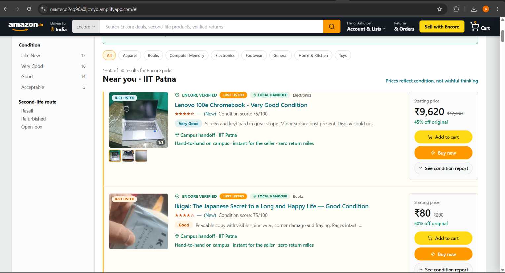

<div align="center">

# Amazon Encore

### Every product deserves another chance.

Built for **HackOn with Amazon Season 6.0** · *Second Life Commerce — AI-Powered Returns & Sustainable Resale*


</div>

---

## Why the name Encore?

In performing arts, an encore is the moment the audience refuses to let the show end. The performer has given everything. The curtain has fallen. But the crowd keeps clapping — calling them back for one more.

*That is what this product is about.*

A returned product is not a failure. It is a performer that did its job, got sent back, and deserves to be called out for one more act. One more owner. One more purpose. Instead of a warehouse shelf or a landfill, it gets an encore.

We named it Encore because the best products — like the best performances — deserve to be remembered.

---

## The problem I actually live with

I am a student at IIT Patna, living in a hostel.

One evening I ordered a ₹400 t-shirt online. It arrived. It did not fit. I raised a return. A rider came the next morning, picked it up, and drove it 200 km back to the nearest fulfilment centre. There it sat — inspected by hand, repackaged, and listed again. A week later, my neighbour on the same floor — who had been thinking about buying that exact same shirt — ordered it. Amazon shipped it 200 km back to our hostel.

The same item made a 400 km round trip to change hands across a corridor.

That is not a logistics problem. That is a missing feature. And I built Encore to fill it.

---

## But the problem goes deeper than that

That shirt story is about wasted distance. The deeper problem is wasted decisions.

Every day, Amazon processes millions of returns. Each one needs a human to inspect it, assign a condition grade, and decide its fate — resell, refurbish, donate, or recycle. That costs between ₹250 and ₹5,000 per item. Millions of times a year. And most of the time, the decision is wrong.

Take a ₹500 running shoe returned in "Good" condition. A human looks at it, marks it resellable, and sends it back to the marketplace. But inspection costs ₹150. Repackaging costs ₹50. Listing and fulfilment costs ₹50 more. The shoe sells for ₹200.

That is a guaranteed ₹50 loss — and nobody flagged it before the decision was made.

**Knowing when not to relist is the product. That is what Encore does.**

- India fashion return rates run at **25–40%**; reverse logistics can cost up to **1.5× the original delivery**
- US retail returns hit **$890B** in 2024, with 9.5 billion lbs of goods reaching landfills yearly
- The demand for second-hand products exists — the bottleneck is **trust in condition**, exactly what explainable AI grading solves

We are not building another marketplace. We are building the **AI decision layer** that automates the routing call Amazon does by hand — and shows the math on screen so the customer always knows why.

---

## How it works — Snap → Grade → Route → Reward

| Step | What happens |
| --- | --- |
| **1 · Snap** | Upload a photo of the returned or unused item. |
| **2 · Grade** | Vision AI (Amazon Bedrock — Kimi K2.5) produces an explainable condition report: grade, confidence score, and observed flaws — from a single photo. |
| **3 · Route** | Our own deterministic engine runs `expected resale value − processing cost = net return`. If the number is negative, Encore does not relist. The math is shown on screen. |
| **4 · Reward** | If resale wins, an LLM writes the condition-accurate listing. If it does not, the customer earns green credits — CO₂ saved, converted to Amazon Pay. |

One thing to be clear about: **the AI never makes the routing decision**. It only tells us what it sees — condition, flaws, confidence. The decision is made by our own deterministic, testable code. Same input, same output, every time. No hallucination on business logic.

<div align="center">

### What the AI sees


### The decision the engine makes — and why


</div>

---

## Encore Campus — the idea that came from living this problem

Back to that hostel corridor.

The shirt did not need to go anywhere. My neighbour was right there. If Amazon had just shown him — "hey, someone two floors up is returning this, want it at a discount?" — the item never leaves the building. No rider. No 400 km trip. No warehouse. No second delivery. Just two students and a shirt, changing hands in a corridor.

That is Encore Campus.

**When you raise a return, we automatically list the item at a discount in your campus feed for 48 hours.** No action needed from you — the item stays with you until it sells. If someone at your college buys it, Amazon arranges a simple handoff and you get paid. The buyer pays less than retail. If nobody buys within 48 hours, a rider picks it up as normal — nothing changes for you.

In a market like India, where a discount is one of the strongest purchase triggers there is, the match rate within 48 hours is not an edge case. It is the default.

The result: Amazon saves the double logistics cost. The original owner gets paid faster. The buyer gets it cheaper. And the item never leaves campus.

We are starting with colleges because the density is right — same pin code, same hostel block, same age group. From there it expands to apartment complexes, local neighbourhoods, and city-level peer resale. The model scales because the insight scales: **the best delivery is no delivery at all.**

<div align="center">



</div>

---

## One more thing about books

Amazon started as a bookstore. That is not a coincidence — it matters here.

Second-hand books are where Encore Campus makes its most natural first move. Same campus. Same course. Same textbook, passing from a third-year student to a first-year student who needs it next semester. No shipping. No warehouse. AI-verified condition. A price both sides feel good about.

Millions of students already want affordable textbooks. Encore gives them a trusted, verified way to find them — and gives the original owner something back instead of nothing.

<div align="center">

| Marketplace · Encore Campus | Impact dashboard |
| :---: | :---: |
|  |  |

</div>

---

## Architecture — *AI perceives, code decides*

```
  Browser (React)          Express API  (server/)
  presentation only  ───►  validates · rate-limits · sanitizes
  no secrets, no math      holds all secrets + keys
                                      │
                    ┌─────────────────┴──────────────────┐
                    ▼                                     ▼
         Amazon Bedrock (Kimi K2.5)              disposition.js
         PERCEIVES only:                         DECIDES:
         condition, flaws,                       value − cost vs carbon
         confidence score                        → routing call
         (never the price)                       (deterministic, testable)
```

- **The AI never makes the business decision.** The resell/donate/recycle call is made by our own deterministic code — consistent, auditable, explainable.
- **The frontend is presentation only.** No API keys, no model IDs, no business math in the browser.
- **The backend is the only thing holding secrets and the only thing talking to the AI.**

---

## Key features

- 🧠 **Explainable AI grading** — condition, flaws, and confidence from a single photo via Amazon Bedrock.
- ⚖️ **Transparent decision engine** — shows `expectedResaleValue − processingCost = netResell` and the carbon math behind every routing call.
- 🌱 **Green credits** — quantified CO₂ savings rewarded to the customer, net of return-shipping emissions.
- 📍 **Encore Campus** — auto-listed at a campus-only discount for 48 hours on every return. If it sells locally, Amazon never touches it.
- ✍️ **Auto-generated listings** — when resale wins, an LLM writes an honest, condition-accurate listing that names real flaws.
- 📊 **Impact dashboard** — running totals of value recovered and CO₂ diverted from landfill.

---

## Tech stack

| Layer | Tech |
| --- | --- |
| Frontend | React 19, Vite 8, Tailwind CSS v3, lucide-react |
| Backend | Node.js, Express 5 |
| AI | Amazon Bedrock — Kimi K2.5 (vision + text); pluggable provider switch |
| Persistence | Supabase (Postgres + Storage + Auth) — optional, with in-memory fallback |
| Security | Input validation, prompt-injection sanitization, CORS allowlist, hardened headers, write-token auth, rate limiting |

---

## Running locally

**Prerequisites:** Node.js 18+ and npm.

```bash
# 1. Install dependencies
npm install

# 2. Create your env file from the template and fill in the values
cp .env.example .env
#    Minimum: an AI provider key (GROQ_API_KEY, or Bedrock keys) + AI_PROVIDER.
#    Supabase keys are optional — the app falls back to in-memory/seed data.

# 3. Start the backend API (Express, port 3001)
npm run server          # or: npm run server:dev  (auto-reload)

# 4. In a second terminal, start the frontend (Vite, port 5173)
npm run dev

# 5. Open http://localhost:5173   (Vite proxies /api → http://localhost:3001)
```

**Other commands**

```bash
npm test          # run the test suite (Vitest) — 65 tests
npm run build     # production build into dist/
npm run preview   # preview the production build
```

**Key environment variables** — see [`.env.example`](./.env.example) for the full list.

| Variable | Purpose |
| --- | --- |
| `AI_PROVIDER` | `groq` (default), `bedrock-bearer`, or `bedrock-sdk` |
| `GROQ_API_KEY` / `GROQ_MODEL_ID` | Groq provider credentials |
| `AWS_BEARER_TOKEN_BEDROCK` / `BEDROCK_MODEL_ID` / `AWS_REGION` | Bedrock (bearer) provider |
| `AWS_ACCESS_KEY_ID` / `AWS_SECRET_ACCESS_KEY` | Bedrock (SDK / IAM) provider |
| `SUPABASE_URL` / `SUPABASE_KEY` | Server-side persistence (optional) |
| `VITE_SUPABASE_URL` / `VITE_SUPABASE_ANON_KEY` | Frontend auth (anon key only — safe to expose) |
| `ALLOWED_ORIGINS` | Comma-separated CORS allowlist for production |
| `MARKETPLACE_WRITE_TOKEN` | Guards `POST /api/marketplace` (leave blank in dev) |

> **Never commit `.env`.** It is gitignored; only `.env.example` (empty values) is tracked.

---

## Project structure

```
amazon-encore/
├── src/                      # React frontend (presentation only)
│   ├── components/           # UI components
│   ├── pages/                # Landing, Intake, Marketplace, Dashboard, …
│   ├── lib/                  # API client, Supabase client
│   └── context/              # Auth context
├── server/                   # Express backend (secrets + AI live here)
│   ├── routes/               # /api/grade, /decide, /listing, /marketplace, /dashboard
│   ├── services/             # AI providers (bedrock, bedrock-sdk, groq) + switch
│   ├── lib/                  # disposition engine, validation, sanitization, parsing
│   ├── middleware/           # rate limit, security headers, write auth
│   └── __tests__/            # Vitest suites (engine + routes)
└── screenshots/              # README images
```

---

## The three personas

- **Priya** returns a ₹500 shoe — 600 km back to the warehouse, costs more to relist than it recovers. Encore routes to **Donate**, math shown on screen. *This is the headline moment.*
- **Rahul** has a baby monitor that works perfectly but will not sell on classifieds. Trusted peer-to-peer resale with an AI condition report.
- **Small Seller** processes 200 returns a month by hand. AI grades and lists in seconds.

---

> *"The team that showed an AI deciding NOT to resell a ₹500 shoe — and explaining why, in money and carbon, on screen — was Amazon Encore."*

---

<div align="center">

**Team** · Ashutosh Kumar (IIT Patna) · Preeti Gupta (KIIT University)

Built for HackOn with Amazon Season 6.0

</div>
