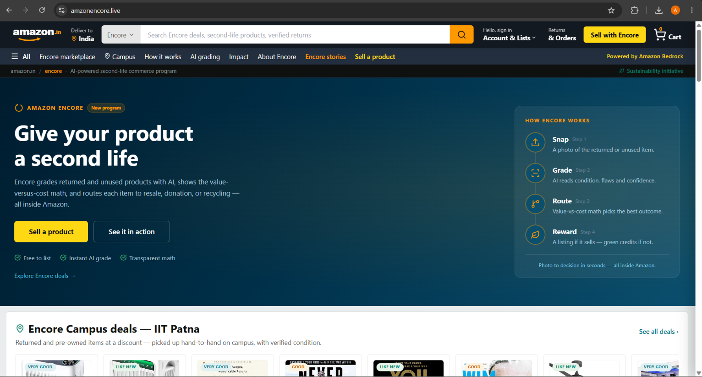
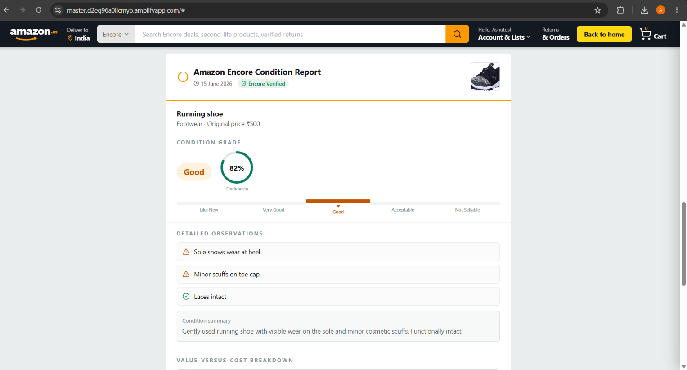
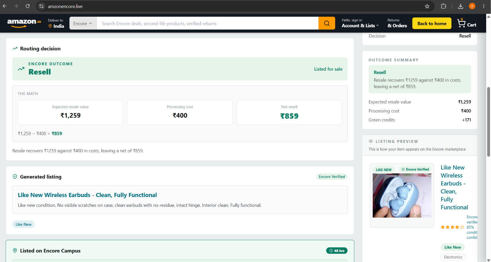
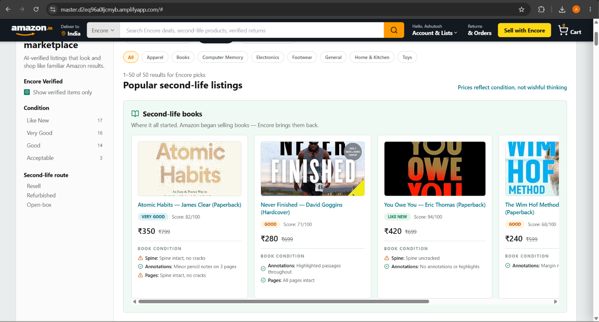
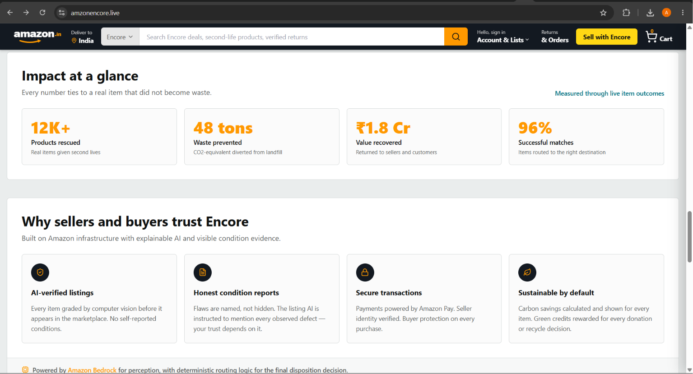

<div align="center">

# Amazon Encore

### Every product deserves another chance.

**An AI intelligence layer that decides the smartest second life for every returned product — resell, refurbish, donate, or recycle — and shows its reasoning in money and carbon, on screen.**

Built for **HackOn with Amazon Season 6.0** · *Second Life Commerce — AI-Powered Returns & Sustainable Resale*




</div>

---

## The one insight that defines this product

> **For a ₹500 shoe returned in "Good" condition, the *correct* AI decision is often NOT to resell it** — because inspection and relisting cost more than the item recovers. *Knowing when not to relist is the product.*

Most teams build "AI grades the item, AI lists the item." **Encore decides whether listing it is even worth it** — the intelligent bridge Amazon's own brief says is missing for the long tail.

---

## The problem

Millions of products are returned, underused, or discarded despite being perfectly usable. Today, when a return arrives, a **human manually inspects it**, assigns a condition grade, and decides its fate — slow, and costing **₹250–5,000+ per return** in labour and reverse logistics, millions of times over.

- US retail returns ≈ **$890B** in 2024; ~9.5 billion lbs of returned goods reach US landfills yearly.
- India fashion return rates: **25–40%**; reverse logistics can cost up to **1.5× the original delivery**.
- The recommerce demand exists — the real bottleneck is **trust in condition**, exactly what explainable AI grading solves.

We are **not** building another marketplace. We're building the **AI decision layer** that automates the routing call Amazon does by hand.

---

## How it works — Snap → Grade → Route → Reward

| Step | What happens |
| --- | --- |
| **1 · Snap** | Upload a photo of the returned/unused item. |
| **2 · Grade** | Vision AI (Amazon Bedrock) produces an explainable condition report and assigns Amazon's real four-tier grade (Like New / Very Good / Good / Acceptable) + a "Not Sellable" outcome, with a confidence score. |
| **3 · Route** | A deterministic engine scores **value vs. cost vs. carbon** and picks the optimal fate. The math is shown on screen. |
| **4 · Reward** | The customer earns quantified green credits; if resale wins, an LLM auto-writes the condition-accurate listing. |

<div align="center">

### AI condition grade


### The decision math — our differentiator


</div>

---

## Architecture — *AI perceives, code decides*

A deliberate separation that keeps the system trustworthy and auditable:

```
                         ┌──────────────────────────────┐
  Browser (React)        │  Express API  (server/)       │
  presentation only ───► │  validates · rate-limits ·    │
  no secrets, no math    │  sanitizes · holds all secrets│
                         └───────────────┬───────────────┘
                            ┌────────────┴────────────┐
                            ▼                          ▼
                  ┌───────────────────┐    ┌──────────────────────┐
                  │ Amazon Bedrock     │    │ disposition.js        │
                  │ PERCEIVES only:    │    │ DECIDES:              │
                  │ condition, flaws,  │    │ value − cost vs       │
                  │ confidence         │    │ carbon → the routing  │
                  │ (never the price)  │    │ call (deterministic)  │
                  └───────────────────┘    └──────────────────────┘
```

- **The AI never makes the business decision.** It only reports what it sees. The resell/donate/recycle call is made by our own deterministic, testable code — so pricing is consistent, explainable, and auditable.
- **The frontend is presentation only.** No API keys, no model IDs, no business math in the browser. It calls our own `/api/*` endpoints and renders results.
- **The backend is the only thing holding secrets and the only thing talking to the AI.**

---

## Key features

- 🧠 **Explainable AI grading** via Amazon Bedrock — condition, flaws, and confidence from a single photo.
- ⚖️ **Transparent decision engine** — shows `expectedResaleValue − processingCost = netResell` and the carbon math behind every routing call.
- 🌱 **Green credits** — quantified CO₂ savings rewarded to the customer, net of return-shipping emissions.
- 📍 **Encore Campus** — a location-aware resale feed: nearby buyers get returned/open-box items at a discount via hand-to-hand handoff, zero reverse-logistics miles.
- ✍️ **Auto-generated listings** — when resale wins, an LLM writes an honest, condition-accurate listing that names real flaws.
- 📊 **Impact dashboard** — running totals of value recovered and CO₂ diverted from landfill.

<div align="center">

| Marketplace · Encore Campus | Impact dashboard |
| :---: | :---: |
|  |  |

</div>

---

## Tech stack

| Layer | Tech |
| --- | --- |
| Frontend | React 19, Vite 8, Tailwind CSS v3, lucide-react |
| Backend | Node.js, Express 5 |
| AI | Amazon Bedrock (Claude vision + text); pluggable provider switch |
| Persistence | Supabase (Postgres + Storage + Auth) — optional, with in-memory fallback |
| Security | Input validation, prompt-injection sanitization, CORS allowlist, hardened headers, write-token auth, rate limiting |

---

## Running locally

**Prerequisites:** Node.js 18+ and npm.

```bash
# 1. Install dependencies
npm install

# 2. Create your env file from the template and fill in the values
cp .env.example .env
#    Minimum: an AI provider key (GROQ_API_KEY, or Bedrock keys) + AI_PROVIDER.
#    Supabase keys are optional — the app falls back to in-memory/seed data.

# 3. Start the backend API (Express, port 3001)
npm run server          # or: npm run server:dev  (auto-reload)

# 4. In a second terminal, start the frontend (Vite, port 5173)
npm run dev

# 5. Open http://localhost:5173   (Vite proxies /api → http://localhost:3001)
```

**Other commands**

```bash
npm test          # run the test suite (Vitest) — 65 tests
npm run build     # production build into dist/
npm run preview   # preview the production build
```

**Key environment variables** — see [`.env.example`](./.env.example) for the full list.

| Variable | Purpose |
| --- | --- |
| `AI_PROVIDER` | `groq` (default), `bedrock-bearer`, or `bedrock-sdk` |
| `GROQ_API_KEY` / `GROQ_MODEL_ID` | Groq provider credentials |
| `AWS_BEARER_TOKEN_BEDROCK` / `BEDROCK_MODEL_ID` / `AWS_REGION` | Bedrock (bearer) provider |
| `AWS_ACCESS_KEY_ID` / `AWS_SECRET_ACCESS_KEY` | Bedrock (SDK / IAM) provider |
| `SUPABASE_URL` / `SUPABASE_KEY` | Server-side persistence (optional) |
| `VITE_SUPABASE_URL` / `VITE_SUPABASE_ANON_KEY` | Frontend auth (anon key only — safe to expose) |
| `ALLOWED_ORIGINS` | Comma-separated CORS allowlist for production |
| `MARKETPLACE_WRITE_TOKEN` | Guards `POST /api/marketplace` (leave blank in dev) |

> **Never commit `.env`.** It is gitignored; only `.env.example` (empty values) is tracked.

---

## Project structure

```
amazon-encore/
├── src/                      # React frontend (presentation only)
│   ├── components/           # UI components
│   ├── pages/                # Landing, Intake, Marketplace, Dashboard, …
│   ├── lib/                  # API client, Supabase client
│   └── context/             # Auth context
├── server/                   # Express backend (secrets + AI live here)
│   ├── routes/               # /api/grade, /decide, /listing, /marketplace, /dashboard
│   ├── services/             # AI providers (bedrock, bedrock-sdk, groq) + switch
│   ├── lib/                  # disposition engine, validation, sanitization, parsing
│   ├── middleware/           # rate limit, security headers, write auth
│   └── __tests__/            # Vitest suites (engine + routes)
└── screenshots/              # README images
```

---

## The three personas (resolved live in the demo)

- **Priya** returns a ₹500 shoe — 600 km back to the warehouse, costs more to relist than it's worth. → Encore routes to **Donate**, math shown. *The headline moment.*
- **Rahul** has a baby monitor that works perfectly but won't sell on classifieds. → trusted peer-to-peer resale with an AI trust report.
- **Small Seller** processes 200 returns/month by hand. → AI grades and lists in seconds.

---

## The win condition

> *"The team that showed an AI deciding NOT to resell a ₹500 shoe — and explaining why, in money and carbon, on screen — was Amazon Encore."*

---

<div align="center">

**Team** · Ashutosh Kumar — Full-Stack + AI Engineer

Built for HackOn with Amazon Season 6.0

</div>
